# PassPrep architecture: sequence diagrams

How every part of PassPrep works, request by request. The diagrams are [Mermaid](https://mermaid.js.org/) and render on GitHub, in VS Code (with a Mermaid preview extension) and at [mermaid.live](https://mermaid.live).

Names in the diagrams match the code. `lib/x` means `src/lib/x.ts`, and `actions/x` means `src/app/actions/x.ts`.

## Contents

1. [System overview](#1-system-overview)
2. [Authentication](#2-authentication)
   - 2.1 Route protection (proxy + Data Access Layer)
   - 2.2 Sign up with phone or email
   - 2.3 Log in with a password
   - 2.4 Continue with Google
   - 2.5 Onboarding and editing the study plan
   - 2.6 Log out
3. [Learning](#3-learning)
   - 3.1 Dashboard
   - 3.2 Subjects and starting a practice set
   - 3.3 Loading the practice screen
   - 3.4 Answering a question (limit, streak, points)
4. [Solution videos](#4-solution-videos)
   - 4.1 Deciding what the video button does
   - 4.2 Premium: teacher video or YouTube search
   - 4.3 Free plan: spending a free daily video
   - 4.4 Playing a video and reporting a question
5. [Motivation and progress](#5-motivation-and-progress)
   - 5.1 Weekly leaderboard
   - 5.2 Progress (basic and Premium detail)
6. [Payments (Paystack)](#6-payments-paystack)
   - 6.1 Student checkout
   - 6.2 Return from Paystack (verify) and the result page
   - 6.3 Webhook: charge.success and recurring card renewals
   - 6.4 Webhook: subscription lifecycle events
   - 6.5 Parent pay link
   - 6.6 Cancelling automatic renewal
   - 6.7 Who counts as Premium
7. [Admin and content](#7-admin-and-content)
   - 7.1 Admin access and navigation
   - 7.2 Syllabus import (topics)
   - 7.3 Question import
   - 7.4 Review queue (second-teacher rule)
   - 7.5 Editing, unpublishing and flags
   - 7.6 Metrics dashboard
8. [Public site, SEO and share cards](#8-public-site-seo-and-share-cards)
   - 8.1 Landing page
   - 8.2 Crawlers and link previews
9. [Analytics events](#9-analytics-events)
10. [Build, deploy and operations](#10-build-deploy-and-operations)

---

## 1. System overview

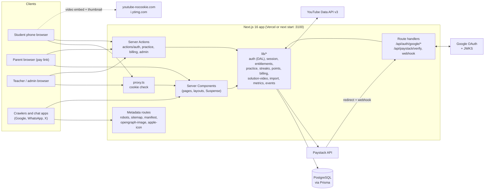
```mermaid
flowchart LR
  subgraph Clients
    S["Student phone browser"]
    P["Parent browser (pay link)"]
    T["Teacher / admin browser"]
    B["Crawlers and chat apps<br/>(Google, WhatsApp, X)"]
  end

  subgraph Next["Next.js 16 app (Vercel or next start :3100)"]
    PX["proxy.ts<br/>cookie check"]
    RSC["Server Components<br/>(pages, layouts, Suspense)"]
    SA["Server Actions<br/>actions/auth, practice, billing, admin"]
    RH["Route handlers<br/>/api/auth/google/*<br/>/api/paystack/verify, webhook"]
    META["Metadata routes<br/>robots, sitemap, manifest,<br/>opengraph-image, apple-icon"]
    LIB["lib/*<br/>auth (DAL), session, entitlements,<br/>practice, streaks, points, billing,<br/>solution-video, import, metrics, events"]
  end

  DB[("PostgreSQL<br/>via Prisma")]
  G["Google OAuth<br/>+ JWKS"]
  PS["Paystack API"]
  YT["YouTube Data API v3"]
  YTE["youtube-nocookie.com<br/>i.ytimg.com"]

  S --> PX --> RSC
  S --> SA
  P --> RSC
  P --> SA
  T --> PX
  T --> SA
  B --> META
  B --> RSC
  RSC --> LIB
  SA --> LIB
  RH --> LIB
  LIB --> DB
  RH <--> G
  LIB --> PS
  PS -- "redirect + webhook" --> RH
  LIB --> YT
  S -. "video embed + thumbnail" .-> YTE
```

**Main tables:** `User`, `UserSubject`, `Subject`, `Topic` (subtopics have a `parentId`), `Question`, `PracticeSession`, `Attempt`, `WeeklyScore`, `VideoUnlock`, `Subscription`, `Payment`, `PlanPrice`, `PayLink`, `Flag`, `ImportBatch`, `Event`.

**Time:** every day and week boundary uses Africa/Lagos time (UTC+1, no daylight saving), from `lib/time`. Calendar dates are stored as Postgres `DATE` values.

---

## 2. Authentication

Sessions are a signed JWT (HS256, `SESSION_SECRET`) in an httpOnly cookie, `pp_session`, that lasts 30 days. There is no session table.

### 2.1 Route protection (proxy + Data Access Layer)

`proxy.ts` only checks that the cookie exists, which is cheap. The real check happens on the server in `lib/auth` (`getCurrentUser`, wrapped in React `cache()` so it runs once per request), and every Server Action reads the session again.

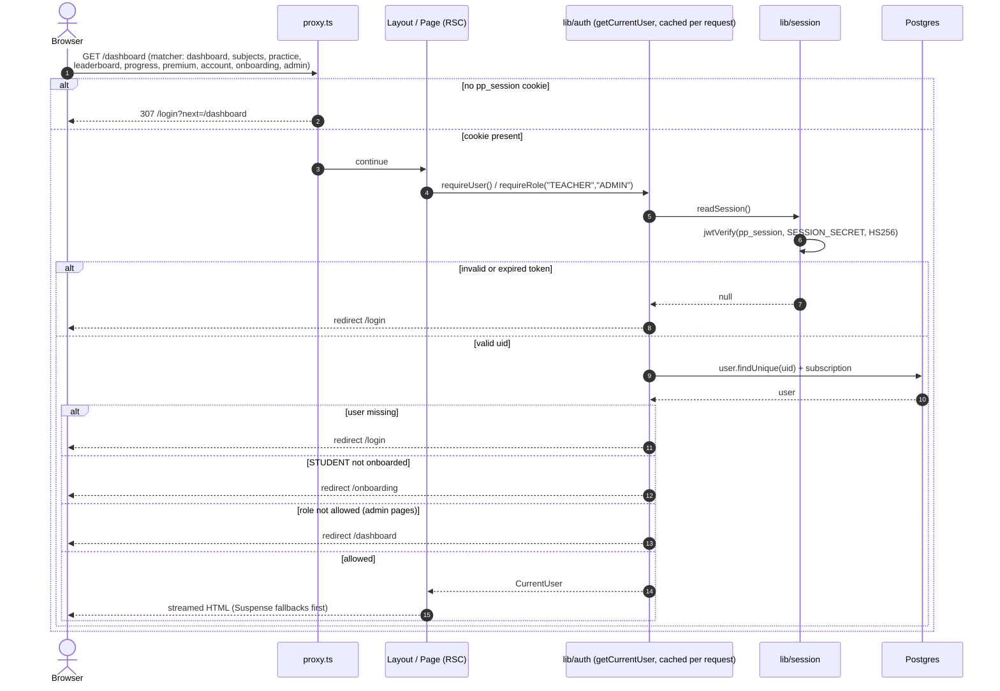
```mermaid
sequenceDiagram
  autonumber
  actor U as Browser
  participant PX as proxy.ts
  participant L as Layout / Page (RSC)
  participant DAL as lib/auth (getCurrentUser, cached per request)
  participant SES as lib/session
  participant DB as Postgres

  U->>PX: GET /dashboard (matcher: dashboard, subjects, practice,<br/>leaderboard, progress, premium, account, onboarding, admin)
  alt no pp_session cookie
    PX-->>U: 307 /login?next=/dashboard
  else cookie present
    PX->>L: continue
    L->>DAL: requireUser() / requireRole("TEACHER","ADMIN")
    DAL->>SES: readSession()
    SES->>SES: jwtVerify(pp_session, SESSION_SECRET, HS256)
    alt invalid or expired token
      SES-->>DAL: null
      DAL-->>U: redirect /login
    else valid uid
      DAL->>DB: user.findUnique(uid) + subscription
      DB-->>DAL: user
      alt user missing
        DAL-->>U: redirect /login
      else STUDENT not onboarded
        DAL-->>U: redirect /onboarding
      else role not allowed (admin pages)
        DAL-->>U: redirect /dashboard
      else allowed
        DAL-->>L: CurrentUser
        L-->>U: streamed HTML (Suspense fallbacks first)
      end
    end
  end
```

### 2.2 Sign up with phone or email

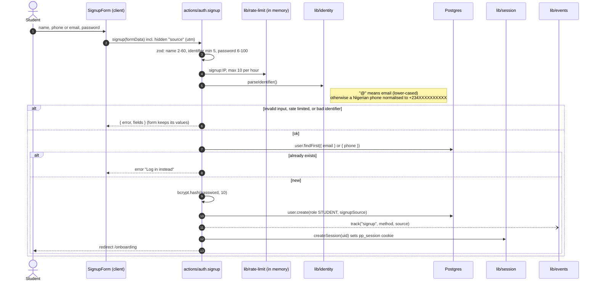
```mermaid
sequenceDiagram
  autonumber
  actor U as Student
  participant F as SignupForm (client)
  participant A as actions/auth.signup
  participant RL as lib/rate-limit (in memory)
  participant ID as lib/identity
  participant DB as Postgres
  participant SES as lib/session
  participant EV as lib/events

  U->>F: name, phone or email, password
  F->>A: signup(formData) incl. hidden "source" (utm)
  A->>A: zod: name 2-60, identifier min 5, password 6-100
  A->>RL: signup:IP, max 10 per hour
  A->>ID: parseIdentifier()
  Note right of ID: "@" means email (lower-cased)<br/>otherwise a Nigerian phone normalised to +234XXXXXXXXXX
  alt invalid input, rate limited, or bad identifier
    A-->>F: { error, fields } (form keeps its values)
  else ok
    A->>DB: user.findFirst({ email } or { phone })
    alt already exists
      A-->>F: error "Log in instead"
    else new
      A->>A: bcrypt.hash(password, 10)
      A->>DB: user.create(role STUDENT, signupSource)
      A--)EV: track("signup", method, source)
      A->>SES: createSession(uid) sets pp_session cookie
      A-->>U: redirect /onboarding
    end
  end
```

### 2.3 Log in with a password

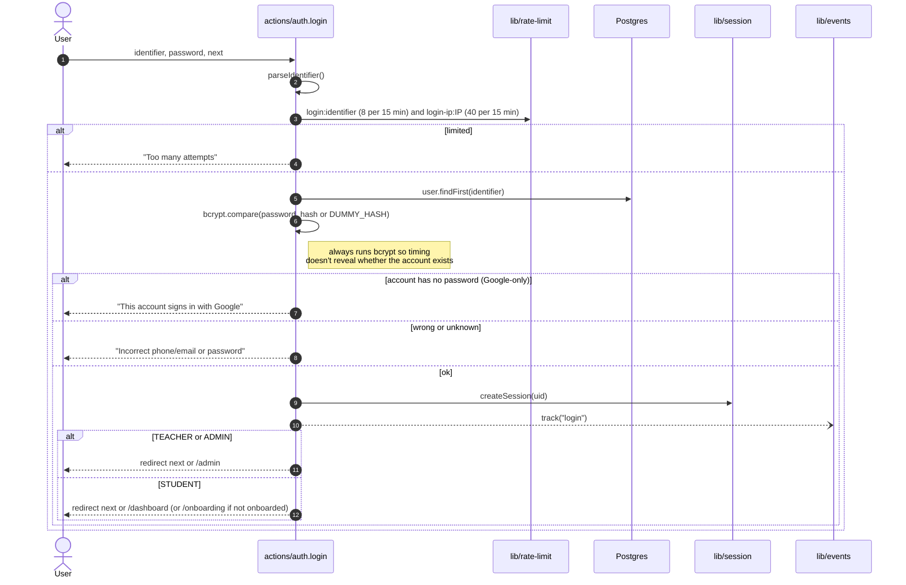
```mermaid
sequenceDiagram
  autonumber
  actor U as User
  participant A as actions/auth.login
  participant RL as lib/rate-limit
  participant DB as Postgres
  participant SES as lib/session
  participant EV as lib/events

  U->>A: identifier, password, next
  A->>A: parseIdentifier()
  A->>RL: login:identifier (8 per 15 min) and login-ip:IP (40 per 15 min)
  alt limited
    A-->>U: "Too many attempts"
  else
    A->>DB: user.findFirst(identifier)
    A->>A: bcrypt.compare(password, hash or DUMMY_HASH)
    Note right of A: always runs bcrypt so timing<br/>doesn't reveal whether the account exists
    alt account has no password (Google-only)
      A-->>U: "This account signs in with Google"
    else wrong or unknown
      A-->>U: "Incorrect phone/email or password"
    else ok
      A->>SES: createSession(uid)
      A--)EV: track("login")
      alt TEACHER or ADMIN
        A-->>U: redirect next or /admin
      else STUDENT
        A-->>U: redirect next or /dashboard (or /onboarding if not onboarded)
      end
    end
  end
```

`next` is accepted only when it is a same-site path (starts with `/` but not `//`).

### 2.4 Continue with Google

OAuth 2.0 authorization code flow with PKCE, a `state` value against CSRF, and a `nonce` bound to the ID token. The button shows only when `GOOGLE_CLIENT_ID` and `GOOGLE_CLIENT_SECRET` are set, and it is rendered in the Suspense fallback too, so the form doesn't move when the page finishes loading.

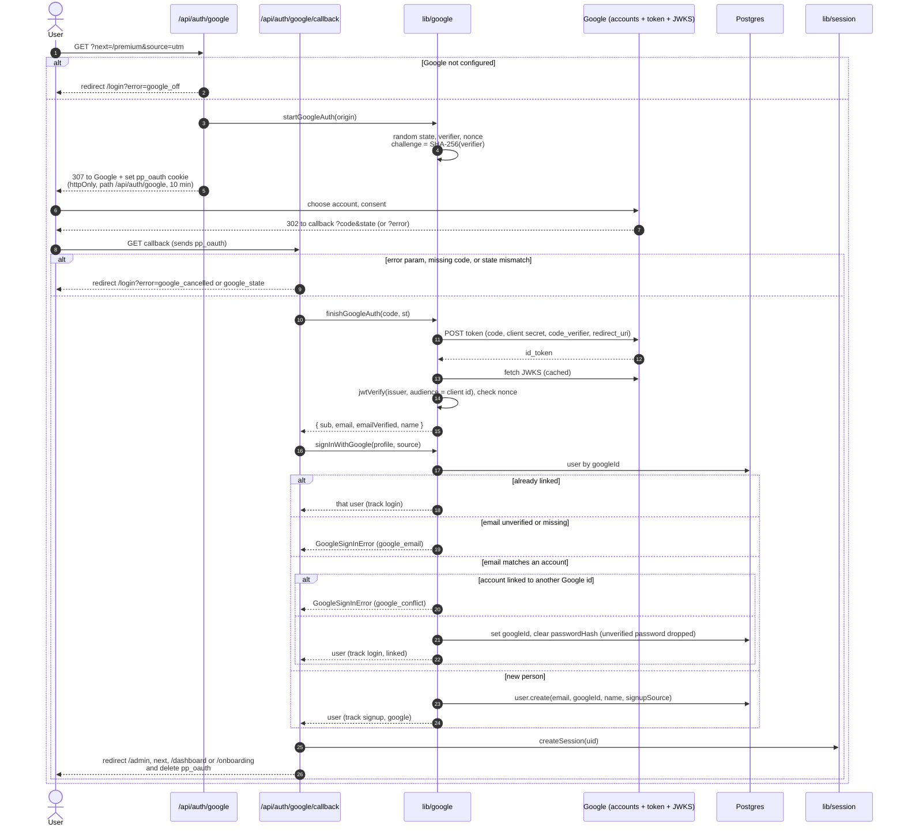
```mermaid
sequenceDiagram
  autonumber
  actor U as User
  participant S as /api/auth/google
  participant CB as /api/auth/google/callback
  participant GL as lib/google
  participant GA as Google (accounts + token + JWKS)
  participant DB as Postgres
  participant SES as lib/session

  U->>S: GET ?next=/premium&source=utm
  alt Google not configured
    S-->>U: redirect /login?error=google_off
  else
    S->>GL: startGoogleAuth(origin)
    GL->>GL: random state, verifier, nonce<br/>challenge = SHA-256(verifier)
    S-->>U: 307 to Google + set pp_oauth cookie<br/>(httpOnly, path /api/auth/google, 10 min)
    U->>GA: choose account, consent
    GA-->>U: 302 to callback ?code&state (or ?error)
    U->>CB: GET callback (sends pp_oauth)
    alt error param, missing code, or state mismatch
      CB-->>U: redirect /login?error=google_cancelled or google_state
    else
      CB->>GL: finishGoogleAuth(code, st)
      GL->>GA: POST token (code, client secret, code_verifier, redirect_uri)
      GA-->>GL: id_token
      GL->>GA: fetch JWKS (cached)
      GL->>GL: jwtVerify(issuer, audience = client id), check nonce
      GL-->>CB: { sub, email, emailVerified, name }
      CB->>GL: signInWithGoogle(profile, source)
      GL->>DB: user by googleId
      alt already linked
        GL-->>CB: that user (track login)
      else email unverified or missing
        GL-->>CB: GoogleSignInError (google_email)
      else email matches an account
        alt account linked to another Google id
          GL-->>CB: GoogleSignInError (google_conflict)
        else
          GL->>DB: set googleId, clear passwordHash (unverified password dropped)
          GL-->>CB: user (track login, linked)
        end
      else new person
        GL->>DB: user.create(email, googleId, name, signupSource)
        GL-->>CB: user (track signup, google)
      end
      CB->>SES: createSession(uid)
      CB-->>U: redirect /admin, next, /dashboard or /onboarding<br/>and delete pp_oauth
    end
  end
```

### 2.5 Onboarding and editing the study plan

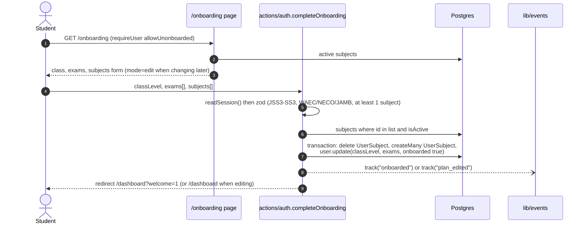
```mermaid
sequenceDiagram
  autonumber
  actor U as Student
  participant P as /onboarding page
  participant A as actions/auth.completeOnboarding
  participant DB as Postgres
  participant EV as lib/events

  U->>P: GET /onboarding (requireUser allowUnonboarded)
  P->>DB: active subjects
  P-->>U: class, exams, subjects form (mode=edit when changing later)
  U->>A: classLevel, exams[], subjects[]
  A->>A: readSession() then zod (JSS3-SS3, WAEC/NECO/JAMB, at least 1 subject)
  A->>DB: subjects where id in list and isActive
  A->>DB: transaction: delete UserSubject, createMany UserSubject,<br/>user.update(classLevel, exams, onboarded true)
  A--)EV: track("onboarded") or track("plan_edited")
  A-->>U: redirect /dashboard?welcome=1 (or /dashboard when editing)
```

### 2.6 Log out

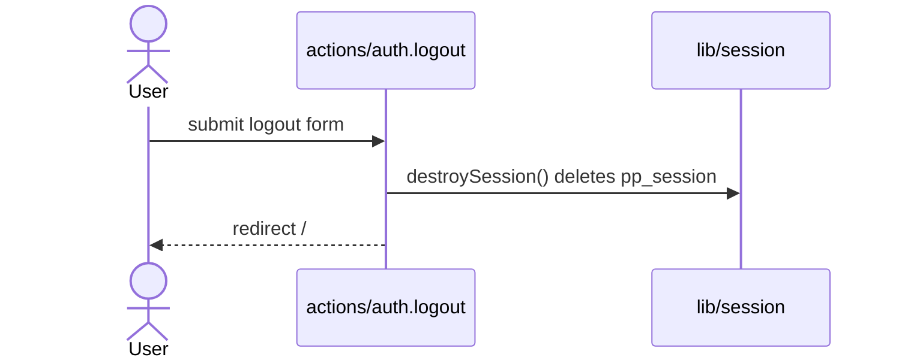
```mermaid
sequenceDiagram
  actor U as User
  participant A as actions/auth.logout
  participant SES as lib/session
  U->>A: submit logout form
  A->>SES: destroySession() deletes pp_session
  A-->>U: redirect /
```

---

## 3. Learning

### 3.1 Dashboard

The page shell and navigation render straight away. Data loads inside `<Suspense>` while a skeleton shows. The sidebar's "Go Premium" card is a separate Suspense boundary that is hidden for Premium users.

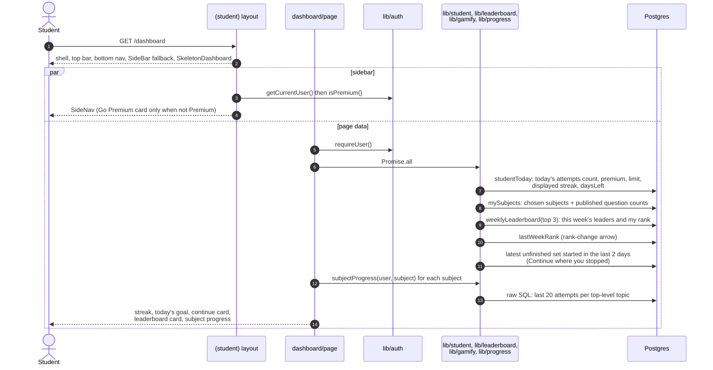
```mermaid
sequenceDiagram
  autonumber
  actor U as Student
  participant LY as (student) layout
  participant D as dashboard/page
  participant DAL as lib/auth
  participant ST as lib/student, lib/leaderboard,<br/>lib/gamify, lib/progress
  participant DB as Postgres

  U->>LY: GET /dashboard
  LY-->>U: shell, top bar, bottom nav, SideBar fallback, SkeletonDashboard
  par sidebar
    LY->>DAL: getCurrentUser() then isPremium()
    LY-->>U: SideNav (Go Premium card only when not Premium)
  and page data
    D->>DAL: requireUser()
    D->>ST: Promise.all
    ST->>DB: studentToday: today's attempts count, premium, limit,<br/>displayed streak, daysLeft
    ST->>DB: mySubjects: chosen subjects + published question counts
    ST->>DB: weeklyLeaderboard(top 3): this week's leaders and my rank
    ST->>DB: lastWeekRank (rank-change arrow)
    ST->>DB: latest unfinished set started in the last 2 days<br/>(Continue where you stopped)
    D->>ST: subjectProgress(user, subject) for each subject
    ST->>DB: raw SQL: last 20 attempts per top-level topic
    D-->>U: streak, today's goal, continue card,<br/>leaderboard card, subject progress
  end
```

### 3.2 Subjects and starting a practice set

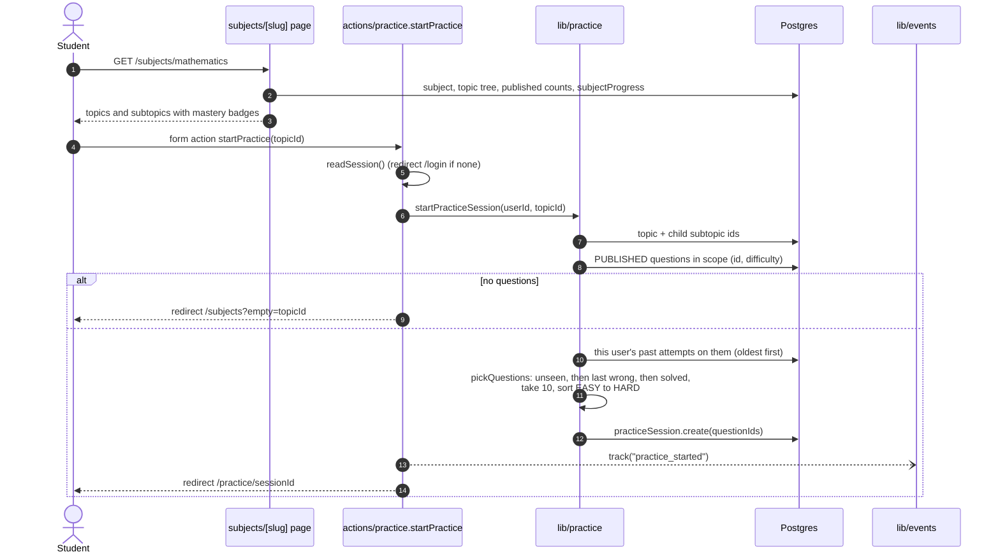
```mermaid
sequenceDiagram
  autonumber
  actor U as Student
  participant SP as subjects/[slug] page
  participant A as actions/practice.startPractice
  participant PR as lib/practice
  participant DB as Postgres
  participant EV as lib/events

  U->>SP: GET /subjects/mathematics
  SP->>DB: subject, topic tree, published counts, subjectProgress
  SP-->>U: topics and subtopics with mastery badges
  U->>A: form action startPractice(topicId)
  A->>A: readSession() (redirect /login if none)
  A->>PR: startPracticeSession(userId, topicId)
  PR->>DB: topic + child subtopic ids
  PR->>DB: PUBLISHED questions in scope (id, difficulty)
  alt no questions
    A-->>U: redirect /subjects?empty=topicId
  else
    PR->>DB: this user's past attempts on them (oldest first)
    PR->>PR: pickQuestions: unseen, then last wrong, then solved,<br/>take 10, sort EASY to HARD
    PR->>DB: practiceSession.create(questionIds)
    A--)EV: track("practice_started")
    A-->>U: redirect /practice/sessionId
  end
```

### 3.3 Loading the practice screen

Answers stay on the server. The page sends only the question and option HTML; correct answers and explanations are sent only for questions already answered in this set.

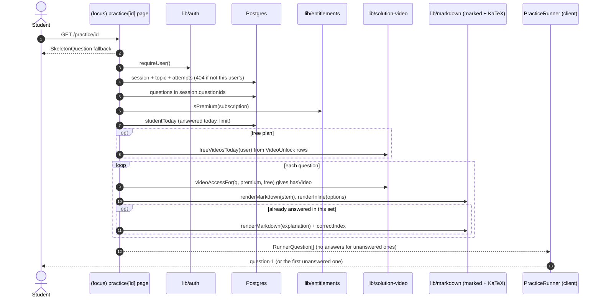
```mermaid
sequenceDiagram
  autonumber
  actor U as Student
  participant PG as (focus) practice/[id] page
  participant DAL as lib/auth
  participant DB as Postgres
  participant ENT as lib/entitlements
  participant SV as lib/solution-video
  participant MD as lib/markdown (marked + KaTeX)
  participant R as PracticeRunner (client)

  U->>PG: GET /practice/id
  PG-->>U: SkeletonQuestion fallback
  PG->>DAL: requireUser()
  PG->>DB: session + topic + attempts (404 if not this user's)
  PG->>DB: questions in session.questionIds
  PG->>ENT: isPremium(subscription)
  PG->>DB: studentToday (answered today, limit)
  opt free plan
    PG->>SV: freeVideosToday(user) from VideoUnlock rows
  end
  loop each question
    PG->>SV: videoAccessFor(q, premium, free) gives hasVideo
    PG->>MD: renderMarkdown(stem), renderInline(options)
    opt already answered in this set
      PG->>MD: renderMarkdown(explanation) + correctIndex
    end
  end
  PG-->>R: RunnerQuestion[] (no answers for unanswered ones)
  R-->>U: question 1 (or the first unanswered one)
```

### 3.4 Answering a question (limit, streak, points)

This is the core write path. Everything is checked on the server, and one database transaction writes the attempt, streak, points, weekly score and set progress together.

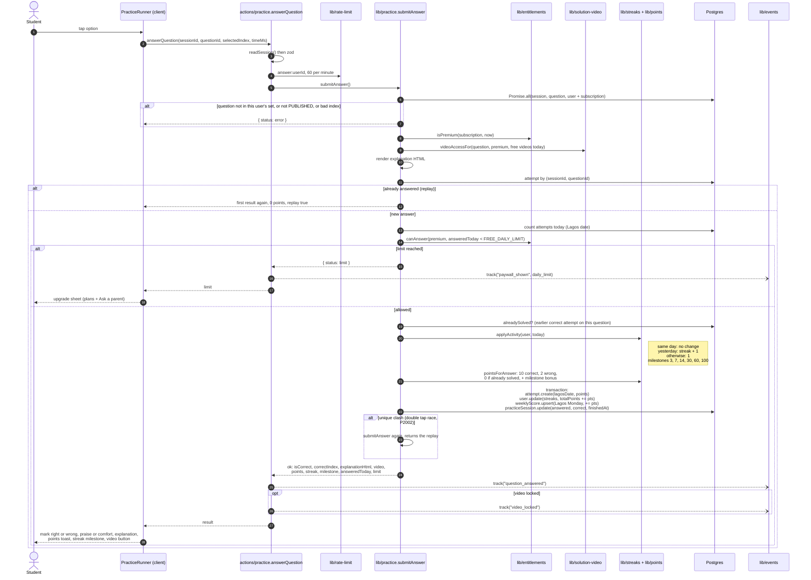
```mermaid
sequenceDiagram
  autonumber
  actor U as Student
  participant R as PracticeRunner (client)
  participant A as actions/practice.answerQuestion
  participant RL as lib/rate-limit
  participant PR as lib/practice.submitAnswer
  participant ENT as lib/entitlements
  participant SV as lib/solution-video
  participant STK as lib/streaks + lib/points
  participant DB as Postgres
  participant EV as lib/events

  U->>R: tap option
  R->>A: answerQuestion(sessionId, questionId, selectedIndex, timeMs)
  A->>A: readSession() then zod
  A->>RL: answer:userId, 60 per minute
  A->>PR: submitAnswer()
  PR->>DB: Promise.all(session, question, user + subscription)
  alt question not in this user's set, or not PUBLISHED, or bad index
    PR-->>R: { status: error }
  end
  PR->>ENT: isPremium(subscription, now)
  PR->>SV: videoAccessFor(question, premium, free videos today)
  PR->>PR: render explanation HTML
  PR->>DB: attempt by (sessionId, questionId)
  alt already answered (replay)
    PR-->>R: first result again, 0 points, replay true
  else new answer
    PR->>DB: count attempts today (Lagos date)
    PR->>ENT: canAnswer(premium, answeredToday < FREE_DAILY_LIMIT)
    alt limit reached
      PR-->>A: { status: limit }
      A--)EV: track("paywall_shown", daily_limit)
      A-->>R: limit
      R-->>U: upgrade sheet (plans + Ask a parent)
    else allowed
      PR->>DB: alreadySolved? (earlier correct attempt on this question)
      PR->>STK: applyActivity(user, today)
      Note right of STK: same day: no change<br/>yesterday: streak + 1<br/>otherwise: 1<br/>milestones 3, 7, 14, 30, 60, 100
      PR->>STK: pointsForAnswer: 10 correct, 2 wrong,<br/>0 if already solved, + milestone bonus
      PR->>DB: transaction:<br/>attempt.create(lagosDate, points)<br/>user.update(streaks, totalPoints += pts)<br/>weeklyScore.upsert(Lagos Monday, += pts)<br/>practiceSession.update(answered, correct, finishedAt)
      alt unique clash (double tap race, P2002)
        PR->>PR: submitAnswer again, returns the replay
      end
      PR-->>A: ok: isCorrect, correctIndex, explanationHtml, video,<br/>points, streak, milestone, answeredToday, limit
      A--)EV: track("question_answered")
      opt video locked
        A--)EV: track("video_locked")
      end
      A-->>R: result
      R-->>U: mark right or wrong, praise or comfort, explanation,<br/>points toast, streak milestone, video button
    end
  end
```

When the last question is answered, `finishedAt` is set and the runner shows the set summary, with buttons to practise again (`startPractice`) or pick another topic.

---

## 4. Solution videos

### 4.1 Deciding what the video button does

`videoAccessFor()` is a pure function that is called while the page renders and after each answer. Its result is one of:

| kind | Meaning | Button |
|---|---|---|
| `open` | A video the student can watch now (teacher's, or a saved YouTube match) | Watch the solution |
| `find` | Premium, but nobody has searched YouTube for this question yet | Watch the solution (searches when opened) |
| `free` | Free plan, and the student still has free videos left today | Watch the solution · N free left today |
| `locked` | Free plan with no allowance left (`usedFree`) or no allowance configured | Upgrade sheet |
| `none` | No video exists, or a teacher blocked the automatic match | Hidden |

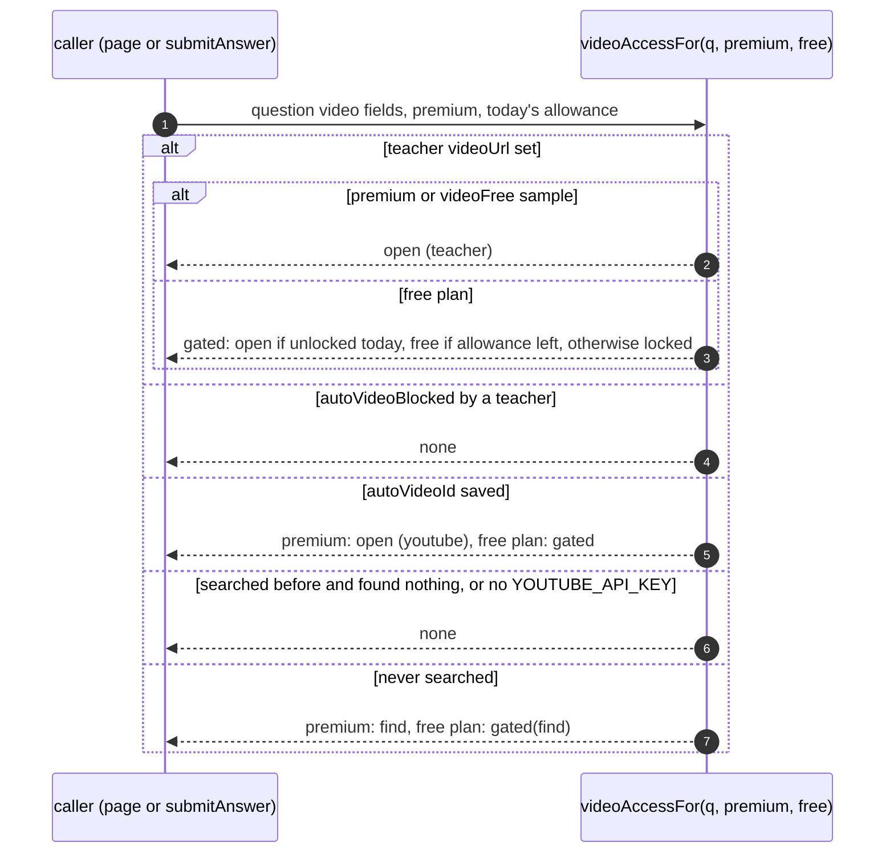
```mermaid
sequenceDiagram
  autonumber
  participant C as caller (page or submitAnswer)
  participant V as videoAccessFor(q, premium, free)
  C->>V: question video fields, premium, today's allowance
  alt teacher videoUrl set
    alt premium or videoFree sample
      V-->>C: open (teacher)
    else free plan
      V-->>C: gated: open if unlocked today, free if allowance left, otherwise locked
    end
  else autoVideoBlocked by a teacher
    V-->>C: none
  else autoVideoId saved
    V-->>C: premium: open (youtube), free plan: gated
  else searched before and found nothing, or no YOUTUBE_API_KEY
    V-->>C: none
  else never searched
    V-->>C: premium: find, free plan: gated(find)
  end
```

### 4.2 Premium: teacher video or YouTube search

The first Premium student to open a question's video triggers one search. The result (or "nothing found") is saved on the question, so everyone after that gets it without another search.

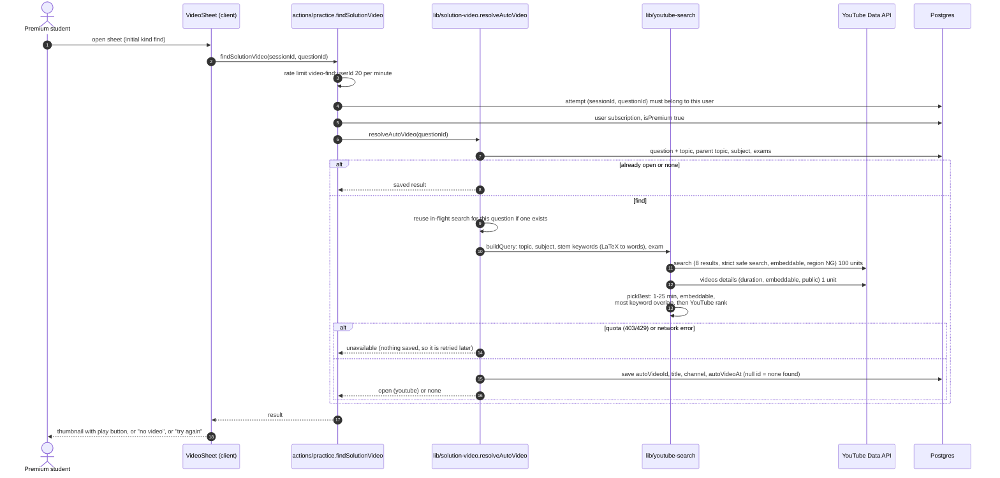
```mermaid
sequenceDiagram
  autonumber
  actor U as Premium student
  participant VS as VideoSheet (client)
  participant A as actions/practice.findSolutionVideo
  participant SV as lib/solution-video.resolveAutoVideo
  participant YS as lib/youtube-search
  participant YT as YouTube Data API
  participant DB as Postgres

  U->>VS: open sheet (initial kind find)
  VS->>A: findSolutionVideo(sessionId, questionId)
  A->>A: rate limit video-find:userId 20 per minute
  A->>DB: attempt (sessionId, questionId) must belong to this user
  A->>DB: user subscription, isPremium true
  A->>SV: resolveAutoVideo(questionId)
  SV->>DB: question + topic, parent topic, subject, exams
  alt already open or none
    SV-->>A: saved result
  else find
    SV->>SV: reuse in-flight search for this question if one exists
    SV->>YS: buildQuery: topic, subject, stem keywords (LaTeX to words), exam
    YS->>YT: search (8 results, strict safe search, embeddable, region NG) 100 units
    YS->>YT: videos details (duration, embeddable, public) 1 unit
    YS->>YS: pickBest: 1-25 min, embeddable,<br/>most keyword overlap, then YouTube rank
    alt quota (403/429) or network error
      SV-->>A: unavailable (nothing saved, so it is retried later)
    else
      SV->>DB: save autoVideoId, title, channel, autoVideoAt (null id = none found)
      SV-->>A: open (youtube) or none
    end
  end
  A-->>VS: result
  VS-->>U: thumbnail with play button, or "no video", or "try again"
```

### 4.3 Free plan: spending a free daily video

The allowance comes from `FREE_DAILY_VIDEOS` (0 = teacher-marked samples only). One `VideoUnlock` row is saved per student, Lagos day and question. Nothing is spent if no video exists, and opening the same question again on the same day is free.

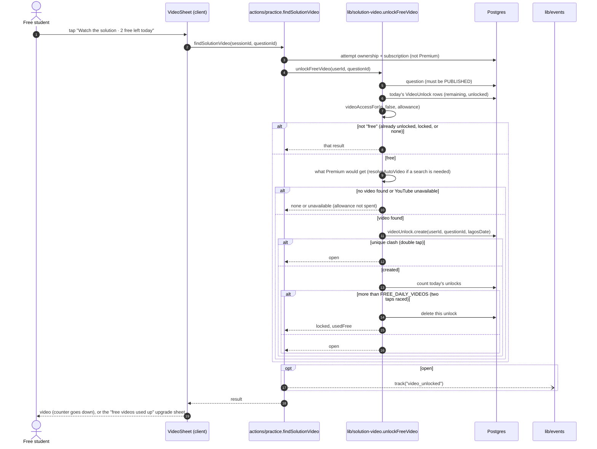
```mermaid
sequenceDiagram
  autonumber
  actor U as Free student
  participant VS as VideoSheet (client)
  participant A as actions/practice.findSolutionVideo
  participant SV as lib/solution-video.unlockFreeVideo
  participant DB as Postgres
  participant EV as lib/events

  U->>VS: tap "Watch the solution · 2 free left today"
  VS->>A: findSolutionVideo(sessionId, questionId)
  A->>DB: attempt ownership + subscription (not Premium)
  A->>SV: unlockFreeVideo(userId, questionId)
  SV->>DB: question (must be PUBLISHED)
  SV->>DB: today's VideoUnlock rows (remaining, unlocked)
  SV->>SV: videoAccessFor(q, false, allowance)
  alt not "free" (already unlocked, locked, or none)
    SV-->>A: that result
  else free
    SV->>SV: what Premium would get (resolveAutoVideo if a search is needed)
    alt no video found or YouTube unavailable
      SV-->>A: none or unavailable (allowance not spent)
    else video found
      SV->>DB: videoUnlock.create(userId, questionId, lagosDate)
      alt unique clash (double tap)
        SV-->>A: open
      else created
        SV->>DB: count today's unlocks
        alt more than FREE_DAILY_VIDEOS (two taps raced)
          SV->>DB: delete this unlock
          SV-->>A: locked, usedFree
        else
          SV-->>A: open
        end
      end
    end
  end
  opt open
    A--)EV: track("video_unlocked")
  end
  A-->>VS: result
  VS-->>U: video (counter goes down), or the "free videos used up" upgrade sheet
```

### 4.4 Playing a video and reporting a question

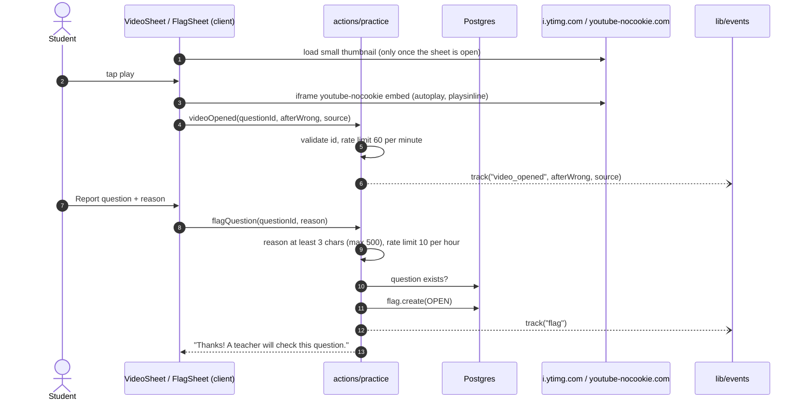
```mermaid
sequenceDiagram
  autonumber
  actor U as Student
  participant VS as VideoSheet / FlagSheet (client)
  participant A as actions/practice
  participant DB as Postgres
  participant YTE as i.ytimg.com / youtube-nocookie.com
  participant EV as lib/events

  VS->>YTE: load small thumbnail (only once the sheet is open)
  U->>VS: tap play
  VS->>YTE: iframe youtube-nocookie embed (autoplay, playsinline)
  VS->>A: videoOpened(questionId, afterWrong, source)
  A->>A: validate id, rate limit 60 per minute
  A--)EV: track("video_opened", afterWrong, source)

  U->>VS: Report question + reason
  VS->>A: flagQuestion(questionId, reason)
  A->>A: reason at least 3 chars (max 500), rate limit 10 per hour
  A->>DB: question exists?
  A->>DB: flag.create(OPEN)
  A--)EV: track("flag")
  A-->>VS: "Thanks! A teacher will check this question."
```

---

## 5. Motivation and progress

### 5.1 Weekly leaderboard

There is no cron job. Scores are stored per (user, Lagos Monday), so a new week starts with an empty board automatically.

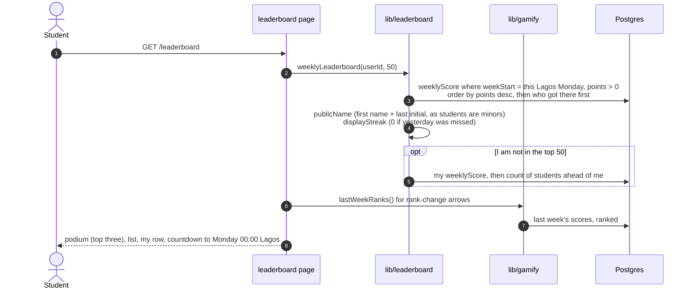
```mermaid
sequenceDiagram
  autonumber
  actor U as Student
  participant P as leaderboard page
  participant LB as lib/leaderboard
  participant GM as lib/gamify
  participant DB as Postgres

  U->>P: GET /leaderboard
  P->>LB: weeklyLeaderboard(userId, 50)
  LB->>DB: weeklyScore where weekStart = this Lagos Monday, points > 0<br/>order by points desc, then who got there first
  LB->>LB: publicName (first name + last initial, as students are minors)<br/>displayStreak (0 if yesterday was missed)
  opt I am not in the top 50
    LB->>DB: my weeklyScore, then count of students ahead of me
  end
  P->>GM: lastWeekRanks() for rank-change arrows
  GM->>DB: last week's scores, ranked
  P-->>U: podium (top three), list, my row, countdown to Monday 00:00 Lagos
```

### 5.2 Progress (basic and Premium detail)

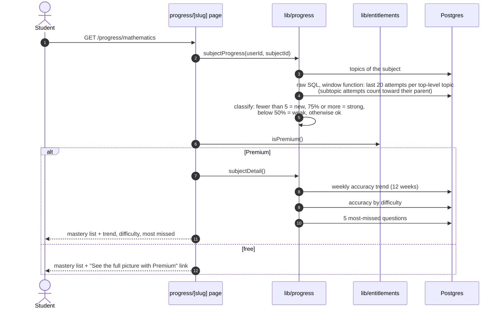
```mermaid
sequenceDiagram
  autonumber
  actor U as Student
  participant P as progress/[slug] page
  participant PG as lib/progress
  participant ENT as lib/entitlements
  participant DB as Postgres

  U->>P: GET /progress/mathematics
  P->>PG: subjectProgress(userId, subjectId)
  PG->>DB: topics of the subject
  PG->>DB: raw SQL, window function: last 20 attempts per top-level topic<br/>(subtopic attempts count toward their parent)
  PG->>PG: classify: fewer than 5 = new, 75% or more = strong,<br/>below 50% = weak, otherwise ok
  P->>ENT: isPremium()
  alt Premium
    P->>PG: subjectDetail()
    PG->>DB: weekly accuracy trend (12 weeks)
    PG->>DB: accuracy by difficulty
    PG->>DB: 5 most-missed questions
    P-->>U: mastery list + trend, difficulty, most missed
  else free
    P-->>U: mastery list + "See the full picture with Premium" link
  end
```

---

## 6. Payments (Paystack)

There are two billing modes:

- **AUTO_RENEW:** card only. Paystack creates a subscription from the plan's `paystackPlan` code.
- **FIXED_PERIOD:** a one-off payment by card, bank transfer, USSD or bank. It adds `periodDays` to the end of the current period.

Prices come from the `PlanPrice` table. Amounts are in kobo.

### 6.1 Student checkout

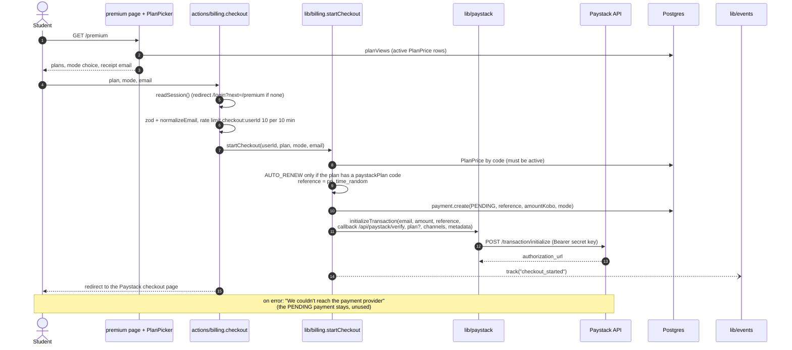
```mermaid
sequenceDiagram
  autonumber
  actor U as Student
  participant PP as premium page + PlanPicker
  participant A as actions/billing.checkout
  participant BL as lib/billing.startCheckout
  participant PSL as lib/paystack
  participant PS as Paystack API
  participant DB as Postgres
  participant EV as lib/events

  U->>PP: GET /premium
  PP->>DB: planViews (active PlanPrice rows)
  PP-->>U: plans, mode choice, receipt email
  U->>A: plan, mode, email
  A->>A: readSession() (redirect /login?next=/premium if none)
  A->>A: zod + normalizeEmail, rate limit checkout:userId 10 per 10 min
  A->>BL: startCheckout(userId, plan, mode, email)
  BL->>DB: PlanPrice by code (must be active)
  BL->>BL: AUTO_RENEW only if the plan has a paystackPlan code<br/>reference = pp_time_random
  BL->>DB: payment.create(PENDING, reference, amountKobo, mode)
  BL->>PSL: initializeTransaction(email, amount, reference,<br/>callback /api/paystack/verify, plan?, channels, metadata)
  PSL->>PS: POST /transaction/initialize (Bearer secret key)
  PS-->>PSL: authorization_url
  BL--)EV: track("checkout_started")
  A-->>U: redirect to the Paystack checkout page
  Note over U,PS: on error: "We couldn't reach the payment provider"<br/>(the PENDING payment stays, unused)
```

### 6.2 Return from Paystack (verify) and the result page

The return path and the webhook both call `fulfilPayment()`. The atomic PENDING to SUCCESS update makes sure Premium time is added only once.

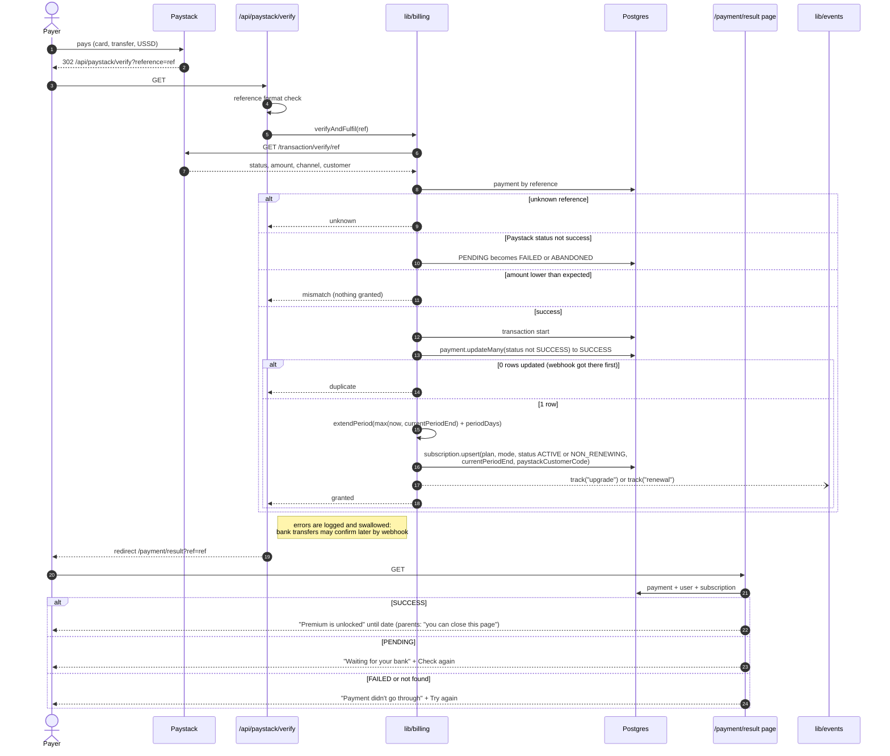
```mermaid
sequenceDiagram
  autonumber
  actor U as Payer
  participant PS as Paystack
  participant V as /api/paystack/verify
  participant BL as lib/billing
  participant DB as Postgres
  participant RP as /payment/result page
  participant EV as lib/events

  U->>PS: pays (card, transfer, USSD)
  PS-->>U: 302 /api/paystack/verify?reference=ref
  U->>V: GET
  V->>V: reference format check
  V->>BL: verifyAndFulfil(ref)
  BL->>PS: GET /transaction/verify/ref
  PS-->>BL: status, amount, channel, customer
  BL->>DB: payment by reference
  alt unknown reference
    BL-->>V: unknown
  else Paystack status not success
    BL->>DB: PENDING becomes FAILED or ABANDONED
  else amount lower than expected
    BL-->>V: mismatch (nothing granted)
  else success
    BL->>DB: transaction start
    BL->>DB: payment.updateMany(status not SUCCESS) to SUCCESS
    alt 0 rows updated (webhook got there first)
      BL-->>V: duplicate
    else 1 row
      BL->>BL: extendPeriod(max(now, currentPeriodEnd) + periodDays)
      BL->>DB: subscription.upsert(plan, mode, status ACTIVE or NON_RENEWING,<br/>currentPeriodEnd, paystackCustomerCode)
      BL--)EV: track("upgrade") or track("renewal")
      BL-->>V: granted
    end
  end
  Note right of V: errors are logged and swallowed:<br/>bank transfers may confirm later by webhook
  V-->>U: redirect /payment/result?ref=ref
  U->>RP: GET
  RP->>DB: payment + user + subscription
  alt SUCCESS
    RP-->>U: "Premium is unlocked" until date (parents: "you can close this page")
  else PENDING
    RP-->>U: "Waiting for your bank" + Check again
  else FAILED or not found
    RP-->>U: "Payment didn't go through" + Try again
  end
```

### 6.3 Webhook: charge.success and recurring card renewals

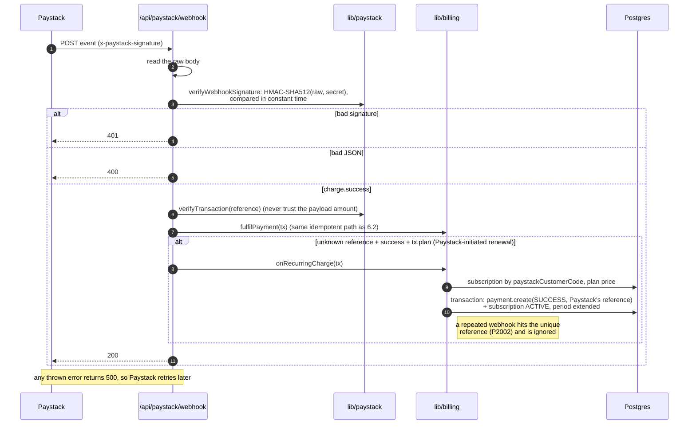
```mermaid
sequenceDiagram
  autonumber
  participant PS as Paystack
  participant W as /api/paystack/webhook
  participant PSL as lib/paystack
  participant BL as lib/billing
  participant DB as Postgres

  PS->>W: POST event (x-paystack-signature)
  W->>W: read the raw body
  W->>PSL: verifyWebhookSignature: HMAC-SHA512(raw, secret),<br/>compared in constant time
  alt bad signature
    W-->>PS: 401
  else bad JSON
    W-->>PS: 400
  else charge.success
    W->>PSL: verifyTransaction(reference) (never trust the payload amount)
    W->>BL: fulfilPayment(tx) (same idempotent path as 6.2)
    alt unknown reference + success + tx.plan (Paystack-initiated renewal)
      W->>BL: onRecurringCharge(tx)
      BL->>DB: subscription by paystackCustomerCode, plan price
      BL->>DB: transaction: payment.create(SUCCESS, Paystack's reference)<br/>+ subscription ACTIVE, period extended
      Note right of BL: a repeated webhook hits the unique<br/>reference (P2002) and is ignored
    end
    W-->>PS: 200
  end
  Note over PS,W: any thrown error returns 500, so Paystack retries later
```

### 6.4 Webhook: subscription lifecycle events

```mermaid
sequenceDiagram
  autonumber
  participant PS as Paystack
  participant W as /api/paystack/webhook
  participant BL as lib/billing
  participant DB as Postgres

  PS->>W: subscription.create
  W->>BL: onSubscriptionCreate
  BL->>DB: subscription by customer_code
  alt not found yet (arrived before charge.success)
    BL-->>W: throw
    W-->>PS: 500 (Paystack retries)
  else
    BL->>DB: save subscription_code, email_token, ACTIVE,<br/>currentPeriodEnd = next_payment_date + 2 days grace
    W-->>PS: 200
  end

  PS->>W: subscription.not_renew or subscription.disable
  W->>BL: onSubscriptionStatus(NON_RENEWING)
  BL->>DB: status NON_RENEWING (access continues until currentPeriodEnd)

  PS->>W: invoice.payment_failed
  W->>BL: onSubscriptionStatus(PAST_DUE)
  BL->>DB: status PAST_DUE (Premium lasts until period end + grace)
```

### 6.5 Parent pay link

A student who can't pay sends a link to a parent. The parent pays without creating an account, and Premium goes to the student who sent the link.

```mermaid
sequenceDiagram
  autonumber
  actor S as Student
  actor PA as Parent
  participant AP as AskParent (client)
  participant A as actions/billing
  participant BL as lib/billing
  participant DB as Postgres
  participant WA as WhatsApp / share sheet
  participant PP as /pay/[token] page
  participant PS as Paystack

  S->>AP: Ask a parent (upgrade sheet or Premium page)
  AP->>A: getParentLink()
  A->>BL: createPayLink(studentId)
  BL->>DB: reuse a link valid for more than 1 more day, or create one<br/>(random 16-byte token, expires in 14 days)
  A--)DB: track("paylink_created")
  A-->>AP: appUrl/pay/token
  AP->>WA: wa.me link or navigator.share with a message
  WA-->>PA: message + link preview (pay/opengraph-image, no student details)
  PA->>PP: GET /pay/token (noindex, no login)
  PP->>DB: payLink + student name, streak, attempts count
  alt unknown token
    PP-->>PA: 404
  else expired
    PP-->>PA: "This link has expired"
  else
    PP->>DB: planViews
    PP-->>PA: "Unlock Premium for Tobi A.", their progress, plans
    PA->>A: checkoutViaPayLink(token, plan, mode, parent email)
    A->>DB: payLink valid?
    A->>BL: startCheckout(studentId, plan, mode, parent email, payLinkId)
    BL->>PS: initialize (as in 6.1)
    A-->>PA: redirect to Paystack, then 6.2 (result page says "Tobi now has Premium")
  end
```

### 6.6 Cancelling automatic renewal

```mermaid
sequenceDiagram
  autonumber
  actor U as Student
  participant C as CancelRenewal (client, confirm)
  participant A as actions/billing.cancelAutoRenew
  participant PSL as lib/paystack
  participant PS as Paystack API
  participant DB as Postgres

  U->>C: Cancel automatic renewal, then confirm
  C->>A: cancelAutoRenew()
  A->>DB: subscription (must be AUTO_RENEW and ACTIVE)
  alt has paystackSubscriptionCode + emailToken
    A->>PSL: disableSubscription(code, token)
    PSL->>PS: POST /subscription/disable
    alt Paystack error
      A-->>C: "We couldn't cancel right now"
    end
  end
  A->>DB: status NON_RENEWING
  A--)DB: track("cancel")
  A-->>C: "You keep Premium until the end of the period you paid for"
```

### 6.7 Who counts as Premium

```mermaid
sequenceDiagram
  participant X as any check (page, action, submitAnswer)
  participant E as lib/entitlements.isPremium
  X->>E: isPremium(subscription, now)
  alt PREMIUM_FOR_EVERYONE is on and VERCEL_ENV is not production
    E-->>X: true (testing switch: no limit, every video)
  else no subscription or status EXPIRED
    E-->>X: false
  else
    E-->>X: currentPeriodEnd > now
  end
  Note over X,E: canAnswer = premium or answeredToday < FREE_DAILY_LIMIT (default 20)<br/>FREE_DAILY_VIDEOS = free videos per Lagos day (default 0)<br/>daysLeft drives the renewal reminder for fixed-period plans
```

---

## 7. Admin and content

Roles: `STUDENT`, `TEACHER`, `ADMIN`. Admin pages check access with `requireRole("TEACHER","ADMIN")`, and every admin action checks it again with `staff()`. Changing the syllabus and unpublishing are for admins only.

### 7.1 Admin access and navigation

```mermaid
sequenceDiagram
  autonumber
  actor T as Teacher or admin
  participant PX as proxy.ts
  participant L as admin/layout (noindex)
  participant N as AdminNav (client)
  participant DAL as lib/auth.requireRole

  T->>PX: GET /admin/... (cookie required)
  PX->>L: continue
  L->>DAL: requireRole(TEACHER, ADMIN)
  DAL-->>L: user (students are redirected to /dashboard)
  L-->>T: header + AdminNavView fallback
  L->>N: usePathname()
  alt desktop (md and up)
    N-->>T: inline links: Overview, Import, Questions, Review, Flags, Metrics
  else phone
    T->>N: tap menu
    N-->>T: dialog drawer (showModal), closes on link, backdrop or route change
  end
```

### 7.2 Syllabus import (topics)

Admins add subjects, topics and subtopics with a CSV or XLSX file. Each upload runs twice: first as a preview, then for real when the admin commits it.

```mermaid
sequenceDiagram
  autonumber
  actor AD as Admin
  participant IF as ImportForm (client)
  participant A as actions/admin.runImport
  participant IM as lib/import
  participant IC as lib/import-commit.importSyllabus
  participant DB as Postgres

  AD->>IF: download templates (syllabus-template.csv)
  AD->>IF: choose file, kind syllabus, Preview
  IF->>A: runImport(kind, intent preview, file)
  A->>A: staff(), size up to 5 MB, ADMIN only for syllabus
  A->>IM: parseUpload: papaparse (CSV) or exceljs (XLSX)
  A->>A: 1-2000 rows, required columns present
  A->>IC: importSyllabus(rows, commit false)
  IC->>IM: validateRows(syllabusRow zod)
  IC-->>IF: report: total, valid, row errors, sample
  IF-->>AD: preview table
  AD->>IF: Commit
  IF->>A: runImport(intent commit)
  A->>IC: importSyllabus(rows, commit true)
  IC->>DB: transaction (60 s): for each row<br/>subject.upsert(slug), topic.upsert(subject + slug),<br/>subtopic.upsert(slug topic--sub, parentId)
  IC->>DB: importBatch.create(kind syllabus, created)
  A->>A: revalidatePath(/admin)
  A-->>IF: report with created + batchId
```

### 7.3 Question import

```mermaid
sequenceDiagram
  autonumber
  actor T as Teacher
  participant A as actions/admin.runImport
  participant IM as lib/import
  participant IC as lib/import-commit.importQuestions
  participant DB as Postgres

  T->>A: questions file, preview or commit
  A->>IM: parseUpload + column check
  A->>IC: importQuestions(rows, opts)
  IC->>IM: validateRows(questionRow): difficulty, 2-5 options,<br/>correct letter exists, explanation required,<br/>YouTube URL valid, stemHash
  IC->>IM: markInFileDuplicates (same text twice in the file)
  IC->>DB: all subjects + topics, mapped subject/topic slug to topicId
  IC->>DB: questions with the same stemHash
  IC->>IC: per row: topic not found means "import the syllabus first",<br/>already in the bank means rejected
  alt preview, or no valid rows
    IC-->>T: report (valid, invalid with line numbers, sample)
  else commit
    IC->>DB: importBatch.create(kind questions)
    IC->>DB: question.createMany(status IN_REVIEW, authorId uploader,<br/>importBatchId, skipDuplicates)
    IC->>DB: importBatch.update(created)
    IC-->>T: report + created count
  end
```

### 7.4 Review queue (second-teacher rule)

```mermaid
sequenceDiagram
  autonumber
  actor R as Reviewer
  participant P as admin/review page
  participant A as actions/admin.reviewQuestion
  participant DB as Postgres

  R->>P: GET /admin/review
  P->>DB: IN_REVIEW questions + topic + author
  P-->>R: rendered preview (markdown + KaTeX) with the correct option marked
  R->>A: approve or reject (+ note)
  A->>A: staff()
  A->>DB: question (must be IN_REVIEW)
  alt reviewer is the author and not ADMIN
    A-->>R: redirect ?error=own
  else approve
    A->>DB: status PUBLISHED, reviewerId, publishedAt
  else reject without a note
    A-->>R: redirect ?error=note
  else reject
    A->>DB: status REJECTED, reviewerId, reviewNote
  end
  A->>A: revalidatePath(/admin/review)
  A-->>R: redirect /admin/review
  Note over DB: only PUBLISHED questions are picked for practice sets (3.2)
```

### 7.5 Editing, unpublishing and flags

```mermaid
sequenceDiagram
  autonumber
  actor T as Teacher or admin
  participant E as QuestionEditor (client, live preview)
  participant A as actions/admin
  participant DB as Postgres

  T->>E: edit stem, options, answer, explanation, difficulty, video
  E->>A: saveQuestion(form)
  A->>A: staff() + zod (2-5 options, explanation 10+ chars,<br/>correct index in range, YouTube URL)
  A->>DB: existing question
  alt ADMIN
    A->>A: keep status (hot-fix live content)
  else TEACHER
    A->>A: DRAFT stays DRAFT, anything else goes back to IN_REVIEW<br/>(teacher becomes the author, reviewer cleared)
  end
  opt stem or topic changed, or "search again" ticked
    A->>A: clear autoVideo fields so the next viewer searches again
  end
  A->>DB: question.update (+ stemHash)
  alt same text already in that topic (P2002)
    A-->>E: "Another question in this topic has the same text"
  else
    A-->>E: saved
  end

  T->>A: unpublishQuestion(id) (ADMIN only)
  A->>DB: status DRAFT

  T->>A: setFlagStatus(id, RESOLVED or DISMISSED) from /admin/flags
  A->>DB: flag.update
```

### 7.6 Metrics dashboard

```mermaid
sequenceDiagram
  autonumber
  actor AD as Admin
  participant P as admin/metrics page
  participant M as lib/metrics
  participant DB as Postgres

  AD->>P: GET /admin/metrics
  P->>M: run all in parallel
  M->>DB: earnings: today, week, this month, last month, 30 days,<br/>year, total, by month (paid_at converted UTC to Lagos)
  M->>DB: weeklySignups + activated within 24 h
  M->>DB: signupSources (utm)
  M->>DB: retentionCohorts D1, D7, D30 (active = answered that Lagos day)
  M->>DB: practiceVolume (answers per student per week)
  M->>DB: streakStats, topicImprovement, mostMissed
  M->>DB: videoEffect (events: video_opened after a wrong answer)
  M->>DB: conversion (paywall to upgrade), paymentMix, renewalRate
  P-->>AD: Amount earned tiles + bar chart, then product metrics
```

---

## 8. Public site, SEO and share cards

### 8.1 Landing page

The landing page is prerendered. Plan prices come from a `"use cache"` function that is refreshed every few hours, so visitors never wait on the database.

```mermaid
sequenceDiagram
  autonumber
  actor V as Visitor
  participant CDN as Next static cache
  participant LP as app/page.tsx
  participant C as plans() "use cache"
  participant DB as Postgres
  participant LPL as landing-play (client islands)

  Note over LP,DB: at build time and on cache revalidation
  LP->>C: plans()
  C->>DB: active PlanPrice rows
  alt ok
    C-->>LP: list (cacheLife hours)
  else DB unreachable
    C-->>LP: empty list (cacheLife minutes, page still builds)
  end
  LP->>LP: JSON-LD: EducationalOrganization, WebSite, FAQPage, Product offers

  V->>CDN: GET /
  CDN-->>V: prerendered HTML + metadata (canonical, OG, Twitter)
  V->>LPL: hydrate: TryQuestions, StreakToy, LeaderboardClimb, PlanChooser
  V->>LPL: answer a sample question, tap the streak, pick a plan (all in the browser)
  LPL-->>V: Start free links to /signup (Google button if enabled)
```

### 8.2 Crawlers and link previews

```mermaid
sequenceDiagram
  autonumber
  participant B as Googlebot / WhatsApp / X
  participant N as Next metadata routes
  participant S as lib/site (siteUrl)

  B->>N: GET /robots.txt
  alt production
    N-->>B: allow /, disallow private routes<br/>(dashboard, practice, admin, api, pay, payment...), sitemap URL
  else preview or local
    N-->>B: disallow everything
  end
  B->>N: GET /sitemap.xml
  N->>S: siteUrl() = APP_URL, Vercel production URL, or localhost
  N-->>B: /, /signup, /login
  B->>N: GET / or /signup or /pay/token (HTML head)
  N-->>B: title template, description, canonical, og:image, twitter card<br/>(signed-in and pay pages are noindex)
  B->>N: GET /opengraph-image, /twitter-image, /pay/opengraph-image
  N-->>B: PNG 1200x630 made at build time with next/og (Satori),<br/>fonts read from assets/fonts
  B->>N: GET /icon.svg, /apple-icon, /manifest.webmanifest
  N-->>B: sun tick icon, 180 px iOS icon, installable app manifest
```

---

## 9. Analytics events

`track()` writes to `Event` without waiting for the result and never makes the request fail. The metrics page (7.6) reads these events together with the business tables.

```mermaid
sequenceDiagram
  participant SRC as action / route / lib
  participant EV as lib/events.track
  participant DB as events table
  SRC->>EV: track(type, userId, props)
  EV--)DB: event.create (not awaited)
  Note right of EV: on failure: console.error only
  Note over SRC,DB: signup, login, onboarded, plan_edited, practice_started,<br/>question_answered, video_opened, video_unlocked, video_locked,<br/>paywall_shown, paylink_created, checkout_started,<br/>upgrade, renewal, cancel, flag
```

---

## 10. Build, deploy and operations

```mermaid
sequenceDiagram
  autonumber
  actor Dev as Developer
  participant Git as Git (staging / main)
  participant V as Vercel (or any Node host)
  participant PR as Prisma CLI
  participant DB as Postgres
  participant NX as next build

  Dev->>Dev: edit prisma/schema.prisma
  Dev->>PR: npm run db:migrate (prisma migrate dev)
  PR->>DB: apply to local DB (docker on 5433)
  PR-->>Dev: new prisma/migrations/timestamp_name/migration.sql
  Dev->>Git: commit code + migration, push
  Git->>V: deploy
  V->>V: npm install (postinstall: prisma generate)
  V->>PR: npm run build: prisma generate
  V->>PR: prisma migrate deploy
  PR->>DB: apply pending migrations (recorded in _prisma_migrations)
  V->>NX: next build
  NX->>DB: prerender landing (plans), build OG images and icons
  NX-->>V: static + server bundles
  V-->>Dev: live

  Note over Dev,DB: one-off scripts against any DATABASE_URL
  Dev->>DB: npm run db:seed (demo subjects, questions, users, scores)
  Dev->>DB: npm run db:seed:content (content only)
  Dev->>DB: npm run db:create-admin -- email [password] [name]
```

**Environment variables that change behaviour:**

| Variable | Effect |
|---|---|
| `DATABASE_URL` | Postgres connection |
| `SESSION_SECRET` | Signs `pp_session` (at least 32 characters) |
| `APP_URL` | Public base URL for pay links, the Paystack callback, the Google redirect URI and SEO |
| `GOOGLE_CLIENT_ID`, `GOOGLE_CLIENT_SECRET` | Turn on Continue with Google |
| `PAYSTACK_SECRET_KEY` (`PAYSTACK_API_BASE` for tests) | Payments and webhook signature |
| `YOUTUBE_API_KEY` | Turns on automatic YouTube solution search |
| `FREE_DAILY_LIMIT` | Free questions per Lagos day (default 20) |
| `FREE_DAILY_VIDEOS` | Free videos per Lagos day (default 0) |
| `PREMIUM_FOR_EVERYONE` | Testing switch, ignored on Vercel production |

**Tests:** unit tests (`npx vitest run tests/unit`), integration tests against Postgres (`npm run test:integration`), an HTTP smoke test (`tests/smoke.mts`), and a Playwright journey (`npm run test:e2e`) that drives sign-up, practice, the daily limit, a pay link, a signed webhook and the unlock. The Playwright test runs against a local Paystack mock set with `PAYSTACK_API_BASE`.
